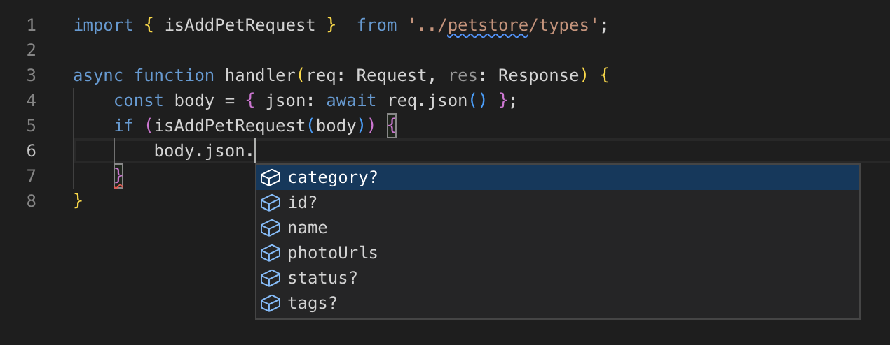

# tapir

Generate TypeScript assertions and type guards from an OpenAPI 3.0 definition



## Features

* Validates a schema against the OpenAPI 3.0 specification
* Validators generated for request bodies, path parameters, query parameters and response bodies
* Generates TypeScript assertions and type guards for all components
* Type guards include validators for OpenAPI formats and types
* Translates schema descriptions into JSDoc comments
* Tree-shakable ESM output

Check out the [examples](examples) directory to see the generated types and assertions for the petstore example.

## Synopsis

```bash
yarn add --dev @emdgroup/tapir
yarn tapir openapi.yml dir/to/lib/

# or use - to read from stdin
cat openapi.yml | yarn tapir - dist/
curl -s https://petstore3.swagger.io/api/v3/openapi.json | yarn tapir - petstore/
```

This will create the following files:

```
dist/
  types.d.ts
  types.js
```

The generated files are self-contained and tree-shakable.
There are no runtime dependencies on `tapir` or any other package.

The generated files use ESM syntax, so you'll need to use a bundler like Rollup or Webpack to bundle them for use in the browser.

## Example

With the following example schema we will illustrate the code that `tapir` is generating. You can open this example at https://codesandbox.io/p/sandbox/tapir-uffo1n and test the generated types and type guards.

```yml
openapi: 3.0.2

info: { title: Synopsis, version: 1.0.0 }

paths:
  /pet/{petId}:
    parameters:
      - $ref: '#/components/parameters/PetId'
    post:
      operationId: UpdatePet
      requestBody:
        content:
          application/json:
            schema:
              $ref: '#/components/schemas/Pet'
      responses:
        200:
          description: OK
          content:
            application/json:
              schema:
                $ref: '#/components/schemas/Pet'
        404:
          description: Not Found

components:
  parameters:
    PetId:
      required: true
      in: path
      name: petId
      schema:
        $ref: '#/components/schemas/PetId'

  schemas:
    PetId:
      type: string
      pattern: ^pet-[0-9a-f]{8}$

    Pet:
      type: object
      required: [name]
      additionalProperties: false
      properties:
        name:
          type: string
          minLength: 1
          maxLength: 64
        status:
          $ref: '#/components/schemas/PetStatus'

    PetStatus:
      type: string
      enum:
        - AVAILABLE
        - PENDING
        - SOLD

```

Tapir will generate a type, type guard and type assertion for every request, response and schema. In our example, this means the following resources are created:

```ts
import type {
  Pet,
  PetId,
  PetStatus,
  UpdatePetRequest,
  UpdatePetResponse,
} from './types';

import {
  isPet,
  isPetId,
  isPetStatus,
  isUpdatePetRequest,
  isUpdatePetResponse,
} from './types';
```

In your server code, you would use these functions like this:

```ts
import type { Pet } from './types';
import { isUpdatePetRequest, isUpdatePetResponse } from './types';

import type { APIGatewayProxyHandlerV2 } from 'aws-lambda';

export const handler: APIGatewayProxyHandlerV2 = async (event) => {
  const request: unknown = {
      pathParameters: event.pathParameters,
      json: event.body ? JSON.parse(event.body) : {},
  }

  if (!isUpdatePetRequest(request)) throw new Error('Bad request');

  // request is now of type UpdatePetRequest, request.json is a Pet
  const pet = await updatePet(request.pathParameters.petId, request.json);

  const response: unknown = { json: pet, statusCode: 200 };

  if (!isUpdatePetResponse(response)) throw new Error('Internal Server Error');

  // response is now of type UpdatePetResponse
  return response;
};
```

On the client, we recommend to skip the type guards since the client should be able to trust the server response.
This has the added benefit that your bundle size will not increase since the types are all stripped out.

```ts
const req = await fetch('/pet/pet-00000000', { method: 'PUT' });
const { json, statusCode } = { json: await req.json(), statusCode: req.status } as UpdatePetResponse;
if (status === 200) {
  // json is of type Pet
} else {
  // handle Not Found.
}
```

Note that every type guard is also exported as type assertion.

```ts
isPetStatus(status); // -> returns true/false
assertPetStatus(status); // -> throws if status is not a valid PetStatus
```
